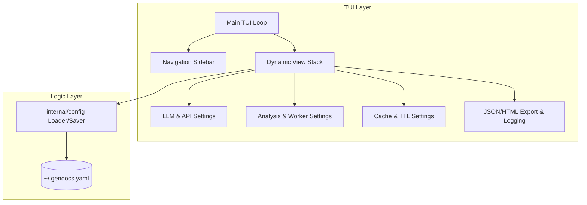

# Refactoring/Design Plan: Gendocs TUI Modernization & Comprehensive Configuration Interface

## 1\. Executive Summary & Goals

The primary objective of this plan is to refactor the current `gendocs` configuration system into a modern, aesthetic Terminal User Interface (TUI) that allows users to manage all application-related settings interactively.

**Key goals:**

  * **Centralized Configuration:** Provide a unified interface to manage LLM providers, API keys, analysis exclusions, worker counts, and advanced LLM parameters (TTL, MaxTokens, etc.).
  * **Enhanced User Experience:** Replace the basic step-by-step wizard with a sophisticated multi-pane interface using modern Go TUI libraries.
  * **In-Place Validation:** Implement real-time validation for API keys and configuration paths within the TUI.

## 2\. Current Situation Analysis

  * **Current State:** The existing `config.go` uses a basic Bubble Tea model with a sequential step-based approach (wizard style) to collect API keys, providers, and base URLs.
  * **Limitations:**
      * It only covers a subset of configurations (LLM provider and API keys).
      * It doesn't allow editing existing configs easily; it's designed as an initial setup tool.
      * Many advanced settings (caching, worker limits, exclusions) still require manual YAML editing or environment variable setting.
      * The visual layout is minimal and lacks modern TUI elements like sidebars, tabs, or grouped forms.

## 3\. Proposed Solution / Refactoring Strategy

### 3.1. High-Level Design / Architectural Overview

The solution will adopt a "Dashboard" approach using the **Bubble Tea** framework and **Lip Gloss** for styling. The architecture will separate the view logic from the configuration management layer.

### 3.2. Key Components / Modules

  * **TUI Router:** A new component to handle navigation between different settings categories (LLM, Analysis, Cache, UI).
  * **Form Components:** Reusable `bubbles/textinput` and `bubbles/list` wrappers that support interactive validation and consistent styling.
  * **Config Persistence Bridge:** An updated version of the configuration loader that supports incremental saves to preserve user comments in the YAML file when possible.

### 3.3. Detailed Action Plan / Phases

#### Phase 1: Interface Foundation & Navigation

  * **Objective:** Establish the multi-pane layout and navigation system.
  * **Priority:** High
  * **Task 1.1:** Refactor `internal/tui/config.go` to support a sidebar-based layout.
      * **Rationale:** Move away from the linear "wizard" to a non-linear "dashboard" for better scalability.
      * **Criteria:** User can switch between "General", "LLM", "Analysis", and "Cache" sections using arrow keys/Tab.
  * **Task 1.2:** Implement a unified "Style System" in `internal/tui/styles.go` using Lip Gloss.
      * **Rationale:** Ensure consistent colors, borders, and padding across all config screens.
      * **Criteria:** All TUI elements use the shared Purple/Indigo primary theme.

#### Phase 2: Full Configuration Mapping

  * **Objective:** Map all YAML model fields to TUI inputs.
  * **Priority:** High
  * **Task 2.1:** Create grouped form views for:
      * **LLM:** Provider, Model, API Key, Base URL, Temperature, MaxTokens.
      * **Analysis:** Max Workers, Max Hash Workers, Force, Incremental.
      * **Cache:** Enabled, Max Size, TTL (days), Cache Path.
      * **Exclusions:** Checkbox list for Code Structure, Data Flow, Deps, etc.
  * **Task 2.2:** Implement "Save" and "Reset" global actions.
      * **Criteria:** Configuration is successfully persisted to `~/.gendocs.yaml` only on explicit save.

#### Phase 3: Advanced UX Features

  * **Objective:** Add polish and reactive feedback.
  * **Priority:** Medium
  * **Task 3.1:** Add "Test Connection" button for LLM providers.
      * **Rationale:** Allow users to verify API keys immediately without exiting the TUI.
      * **Criteria:** TUI shows a loading spinner and then success/error status.
  * **Task 3.2:** Implement tooltips/help text for complex settings (e.g., explaining Max Workers vs CPU count).

### 3.4. API Design / Interface Changes

  * **`cmd/config.go`:** The `runConfig` function will be overhauled to initialize the new dashboard model instead of the simple wizard.
  * **`internal/config/loader.go`:** Add `SaveConfig(path string, cfg *GlobalConfig) error` to support the TUI's persistence needs.

## 4\. Key Considerations & Risk Mitigation

### 4.1. Technical Risks & Challenges

  * **Complexity of State:** Managing 20+ input fields in Bubble Tea can lead to boilerplate-heavy update functions.
      * *Mitigation:* Use a map-based approach for form state or sub-models for each settings category.
  * **Input Masking:** Ensuring API Keys are masked by default while allowing toggling visibility.

### 4.2. Dependencies

  * **Internal:** Requires full access to `internal/config` models and methods.
  * **External:** Relies on `charmbracelet/bubbles`, `bubbletea`, and `lipgloss`.

## 5\. Success Metrics / Validation Criteria

  * **Completeness:** 100% of fields in `internal/config/models.go` are editable via TUI.
  * **Usability:** Setup time for a new user (with API key ready) is under 30 seconds.
  * **Reliability:** Invalid inputs (e.g., negative worker counts) are caught by TUI validation before saving.

## 6\. Assumptions Made

  * The project will continue to use `viper` for the underlying configuration management.
  * Users have terminals supporting ANSI colors and Unicode (required for "pretty" TUI features).

## 7\. Open Questions / Areas for Further Investigation

  * Should we allow managing `.ai/config.yaml` (project-level) and `~/.gendocs.yaml` (global-level) simultaneously within the same TUI?
  * Should the TUI support editing "Custom Prompts" YAML files directly? (Recommended for Phase 4).